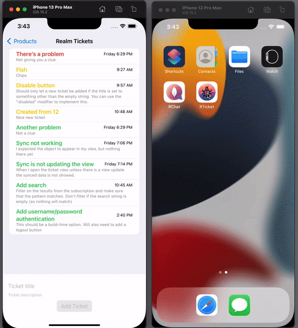

# RTicket
A very simple issue ticket system built using Realm and SwiftUI.

For this app to work, you need both the backend and frontend apps...

## Installation
- [Setup the Realm Backend](Realm)
- [Configure, build and run the iOS app](iOS)

## References
### Common
- [Slides from MongoDB World 2022 workshop](https://docs.google.com/presentation/d/1ORbCHBs_1ehTLzYwv3-sZdR9qweQCH1NXWHU1eQsYtU/edit?usp=sharing)
- [Realm Mobile on the DevHub](https://www.mongodb.com/developer/learn/?products=Mobile)
- [Realm tutorials](https://docs.mongodb.com/realm/sdk/)
- [MongoDB/Realm Community Forum](https://developer.mongodb.com/community/forums/)
- [Introducing Flexible Sync (Preview) – The Next Iteration of Realm Sync](https://www.mongodb.com/developer/article/realm-flexible-sync/)

### iOS
- [Apple's Swift/SwiftUI tutorial (developing the Scrumdinger app)](https://developer.apple.com/tutorials/app-dev-training)
- [Adapting Apple's Scrumdinger SwiftUI Tutorial App to Use Realm](https://developer.mongodb.com/how-to/realm-swiftui-scrumdinger-migration/)
- [Realm Partitioning Strategies](https://developer.mongodb.com/how-to/realm-partitioning-strategies/)
- [Build Offline-First Mobile Apps by Caching API Results in Realm](https://www.mongodb.com/developer/how-to/realm-api-cache/)
- [Using Maps and Location Data in Your SwiftUI (+Realm) App](https://www.mongodb.com/developer/how-to/realm-swiftui-maps-location/)
- [Migrating a SwiftUI iOS App from Core Data to Realm](https://www.mongodb.com/developer/how-to/realm-migrate-from-core-data-swiftui/)
- [Migrating Your iOS App's Realm Schema in Production](https://www.mongodb.com/developer/how-to/realm-schema-migration/)
- [Migrating Your iOS App's Synced Realm Schema in Production](https://www.mongodb.com/developer/how-to/realm-sync-migration/)
- [Most Useful iOS 15 SwiftUI Features](https://www.mongodb.com/developer/how-to/realm-ios15-swiftui/)
- [Using Realm Flexible Sync in Your App—an iOS Tutorial](https://www.mongodb.com/developer/how-to/realm-flex-sync-tutorial)
- [Realm-Swift Type Projections](https://www.mongodb.com/developer/how-to/type-projections/)
- [Goodbye NSPredicate, hello Realm Swift Query API](https://www.mongodb.com/developer/how-to/realm-swift-query-api/)
