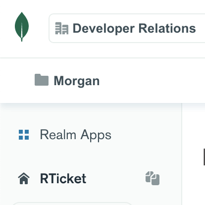

# RTicket Backend Realm App
This is the backend Realm app for RTicket.


## Configure and Run

1. If you don't already have one, [create a MongoDB Atlas Cluster](https://cloud.mongodb.com/), keeping the default name of `Cluster0`.
1. Install the [Realm CLI](https://docs.mongodb.com/realm/deploy/realm-cli-reference) and [create an API key pair](https://docs.atlas.mongodb.com/configure-api-access#programmatic-api-keys).
1. Download the repo and install the Realm app:
```
git clone git@github.com:ClusterDB/RTicket.git
cd Realm/src
realm-cli login --api-key <your new public key> --private-api-key <your new private key>
realm-cli import # Then answer prompts, naming the app RTicket
# For best performance use the same region as your Atlas cluster
```
4. From the Atlas UI, click on the Realm logo and you will see the RTicket app. Open it and copy the App Id



5. Use that App ID in the [iOS app](../iOS)